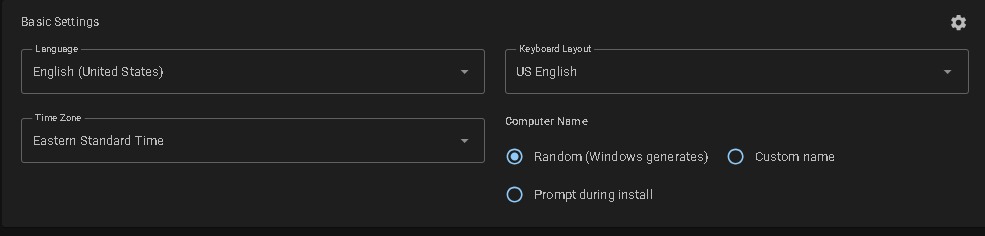
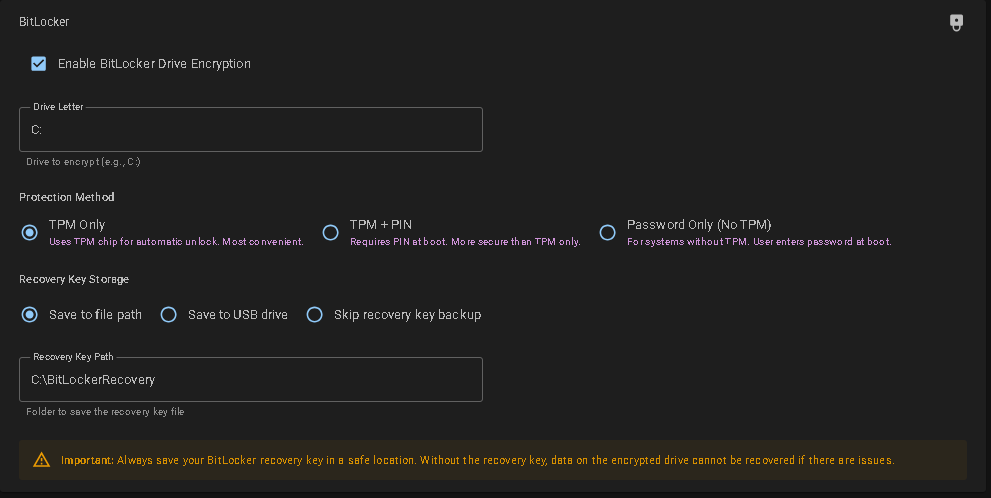

# Windows Key Builder

A web application for generating customized Windows `autounattend.xml` files. This tool helps you create automated Windows installation media with ease.

**[🌐 Live Demo: https://wkey.aunixservers.com/](https://wkey.aunixservers.com/)**

## Preview


## Features & Gallery

### 1. Basic Settings
Configure language, time zone, and computer name. Includes comprehensive support for all Windows 11 regions.


### 2. Disk Partitioning
Automate disk formatting and partitioning (MBR/GPT) to ensure a clean install every time.


### 3. Windows Edition & Key
Select your edition (Pro, Home, Enterprise, etc.) and input product keys.


### 4. User Accounts
Pre-create local user accounts, set passwords, and enable auto-login.


### 5. System Tweaks
Customize the experience:
- **Bypass TPM 2.0 & RAM Checks** (Install on older hardware)
- Disable UAC
- Enable RDP
- Remove Bloatware


### 6. Power Settings
Configure high-performance power plans and disable sleep/hibernate to keep the system running.


### 7. Driver Injection
Automatically install drivers from a USB drive during setup.


### 8. BitLocker Encryption
Enable BitLocker encryption automatically during the first login.


## Getting Started

### Prerequisites

- Docker Desktop or Docker Engine

### Deployment

1. Run the container using Docker Compose:
   ```bash
   docker-compose up -d
   ```

2. Access the application at `http://localhost:8082` or `http://<server-ip>:8082`.

## Tech Stack

- **Framework**: .NET 6.0 (ASP.NET Core / Blazor Server)
- **UI Library**: MudBlazor
- **Containerization**: Docker
